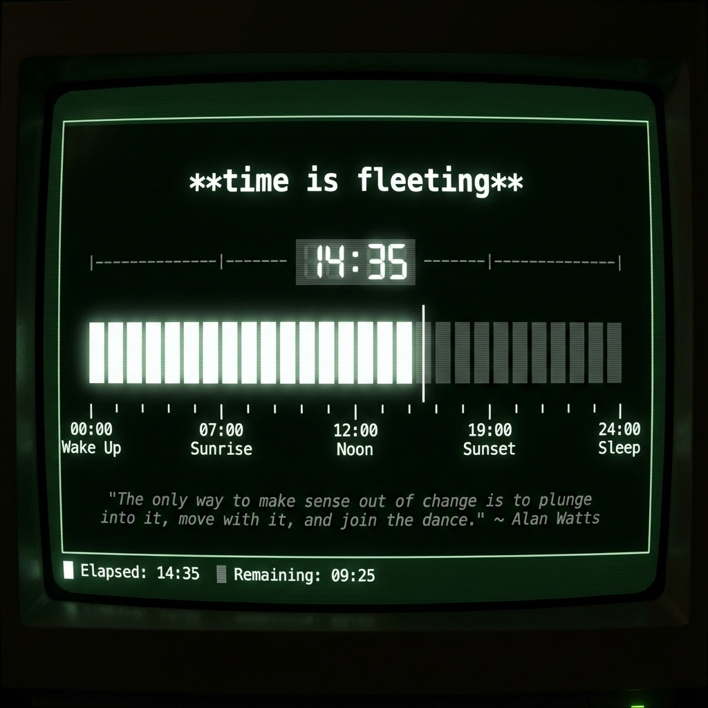

# t-meter



## Hey there! 👋

Welcome to **t-meter**. It's a simple, calm progress bar for your day, running right in your terminal.

## Why?

Life moves fast, doesn't it? Sometimes we get so lost in our screens and our work that we completely lose track of time. We look up and wonder, "Where did the day go?"

I built **t-meter** to be a gentle anchor for you. It’s a little reminder that time is passing, and that’s okay. It helps you stay grounded in the present moment instead of getting lost in the chaos.

## What is it?

Think of it like a fuel gauge or a battery indicator, but for your day.

"2:35 PM" is just a number—it's abstract. **t-meter** turns that number into a visual bar that fills up from the moment you wake up until you go to sleep. It helps you actually _see_ your day.

## How it helps you

Just leave it running in a corner of your screen. It's designed to be a peaceful companion:

-   **See your progress**: Watch your day unfold with a simple, beautiful bar.
-   **Stay connected**: It marks **Sunrise**, **Noon**, and **Sunset** so you stay in sync with the natural world outside.
-   **Take a breath**: Every hour, it shows you a new Zen quote to help you pause and reflect.
-   **Find balance**: By seeing how much of your day is left, you can make better choices about how to spend it.

## Installation

### macOS / Linux (Homebrew)

The easiest way to install on macOS or Linux:

```bash
brew tap jordan-jakisa/tap
brew install t-meter
```

Or in one command:

```bash
brew install jordan-jakisa/tap/t-meter
```

### Standalone Binary (All Platforms)

Download the pre-built binary for your platform:

#### macOS (Intel)

```bash
curl -L https://github.com/jordan-jakisa/t-meter/releases/latest/download/t-meter-x86_64-apple-darwin.tar.gz | tar xz
sudo mv t-meter /usr/local/bin/
```

#### macOS (Apple Silicon)

```bash
curl -L https://github.com/jordan-jakisa/t-meter/releases/latest/download/t-meter-aarch64-apple-darwin.tar.gz | tar xz
sudo mv t-meter /usr/local/bin/
```

#### Linux (x86_64)

```bash
curl -L https://github.com/jordan-jakisa/t-meter/releases/latest/download/t-meter-x86_64-unknown-linux-gnu.tar.gz | tar xz
sudo mv t-meter /usr/local/bin/
```

#### Linux (musl)

```bash
curl -L https://github.com/jordan-jakisa/t-meter/releases/latest/download/t-meter-x86_64-unknown-linux-musl.tar.gz | tar xz
sudo mv t-meter /usr/local/bin/
```

#### Windows (PowerShell)

```powershell
Invoke-WebRequest -Uri "https://github.com/jordan-jakisa/t-meter/releases/latest/download/t-meter-x86_64-pc-windows-msvc.zip" -OutFile "t-meter.zip"
Expand-Archive -Path "t-meter.zip" -DestinationPath "."
Move-Item -Path "t-meter.exe" -Destination "$env:USERPROFILE\AppData\Local\Microsoft\WindowsApps\"
```

### From Source

If you have Rust installed:

```bash
git clone https://github.com/jordan-jakisa/t-meter.git
cd t-meter
cargo install --path t-meter
```

## Usage

Simply run:

```bash
t-meter
```

When you're done, just press `q` or `Ctrl+c`.

Enjoy your day! 🌱
